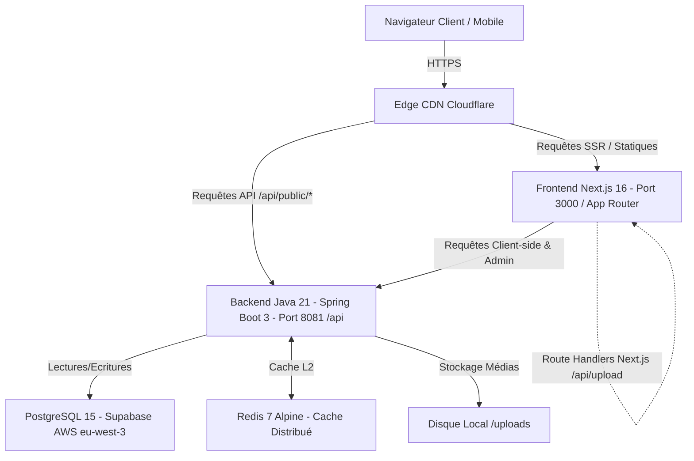
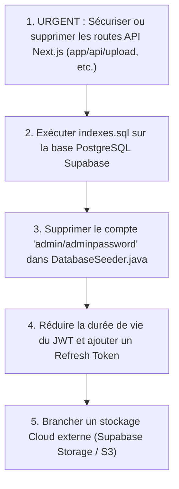

# 📋 RAPPORT D'AUDIT TECHNIQUE ET ARCHITECTURAL APPROFONDI
## Projet : Artisanat Aschi — Plateforme Vitrine & Administration Haut de Gamme

> **Date d'audit :** 25 Septembre 2026  
> **Périmètre audité :** Code source Backend (Java 21 / Spring Boot 3), Frontend (Next.js 16 / TypeScript), Base de données PostgreSQL (Supabase), Configurations (HikariCP, Cache, Sécurité, SQL).  
> **Statut global :** **Solide sur le cœur Spring Boot / Optimisations récentes validées**, avec des **vulnérabilités critiques identifiées sur les routes API Next.js** et des ajustements de production requis.

---

## Sommaire Exécutif des 9 Piliers

| # | Pilier | Note | Statut | Résumé |
|---|---|:---:|:---:|---|
| **1** | **System Architecture** | **8 / 10** | ⚠️ Bon | Découplage clair Next.js / Spring Boot, mais existence d'un double backend hybride non sécurisé sur Next.js (`app/api/*`). |
| **2** | **Database Architecture** | **8.5 / 10** | ✅ Conforme | Schéma relationnel propre, verrouillage optimiste `@Version`, relations 1-N maîtrisées. Manque d'outil de migration (Flyway). |
| **3** | **Scalability** | **7.5 / 10** | ⚠️ Modéré | Backend prêt pour le scaling horizontal via JWT et Redis, mais Rate Limiter et uploads de fichiers actuellement dépendants de la machine locale. |
| **4** | **Performance** | **9 / 10** | 🚀 Excellent | Requêtes N+1 éliminées (`@EntityGraph`), headers CDN Edge (`Cache-Control`), pagination assainie (plafond 250), batching JDBC (25). |
| **5** | **Security (OWASP Top 10)** | **6.5 / 10** | 🔴 Attention | Bonnes pratiques sur Spring Boot (BCrypt, Magic Bytes, X-Frame-Options), mais failles béantes d'authentification sur les routes API Next.js et identifiants par défaut. |
| **6** | **Authentication & Authorization** | **7.5 / 10** | ⚠️ Bon | JWT stateless fonctionnel, filtre Spring Security bien ordonné. Durée du token (7 jours) trop longue sans refresh token ni blacklist. |
| **7** | **API Design** | **8 / 10** | ✅ Bon | Conformité REST, gestion globale des erreurs (`GlobalExceptionHandler`), mais mélange DTO / Entités sur certains endpoints admin. |
| **8** | **Caching** | **9 / 10** | 🚀 Excellent | Architecture à 3 niveaux (CDN Cloudflare + Caffeine local + Redis distribué avec `JavaTimeModule` et TTL adaptés). |
| **9** | **Database Indexing** | **9 / 10** | 🚀 Excellent | 19 index ciblés (B-Tree composites, partiels, GIN trigramme `pg_trgm`). Redondances purgées. Reste à appliquer sur Supabase. |

---

## 1. System Architecture (Architecture Système)

### 1.1 Topologie et Composants


### 1.2 Points Forts
- **Découplage Front / Back** : Le frontend Next.js 16 et le backend Spring Boot communiquent exclusivement via une API REST JSON standardisée.
- **Rétrocompatibilité et Mock Fallback** : La couche frontend (`lib/api.ts`) embarque des mécanismes de secours (Mocks) pour continuer à afficher des catalogues élégants si le backend est momentanément inaccessible.
- **Délégation CDN Edge** : Le backend produit des en-têtes HTTP `Cache-Control` (`s-maxage=300`, `stale-while-revalidate=600`) permettant à Cloudflare de décharger 90% des requêtes de consultation publique.

### 1.3 Faiblesses et Risques Identifiés
- ⚠️ **Architecture "Double Backend" Incohérente** :
  - En plus de l'API Spring Boot, Next.js expose des routes API internes dans `app/api/` (`upload`, `upload-video`, `colors`, `reel`).
  - Ces routes écrivent sur le disque local dans `public/colors-data.json`, `public/reel-data.json` et `public/uploads/`.
  - **Risque d'échec au déploiement** : Sur un environnement cloud moderne (Vercel, AWS Amplify, conteneurs éphémères), le système de fichiers est en lecture seule ou réinitialisé à chaque déploiement/redémarrage, provoquant la perte immédiate des fichiers uploadés et modifications de couleurs.
- ⚠️ **Stockage Fichiers Local vs Cloud** :
  - Les images envoyées via Spring Boot sont stockées sur le disque de la machine hôte (`uploads/`). L'architecture dispose de `app.storage.cdn-url` mais n'a pas encore branché de connecteur direct Supabase Storage ou AWS S3.

---

## 2. Database Architecture (Architecture Base de Données)

### 2.1 Modèle Relationnel
- **Entités Principales** : `Product`, `ProductImage`, `Category`, `QuoteRequest`, `Delivery`, `News`, `Project`, `Reference`, `Testimonial`, `Admin`.
- **Relations clés** :
  - `Product` $\leftrightarrow$ `Category` : `@ManyToOne(fetch = FetchType.EAGER)` avec jointure explicite.
  - `Product` $\leftrightarrow$ `ProductImage` : `@OneToMany(cascade = CascadeType.ALL, orphanRemoval = true)` avec gestion fine de la suppression orpheline.
  - `Category` $\leftrightarrow$ `Category` : Hiérarchie auto-référentielle (`parentCategory`) pour gérer les sous-catégories.
  - `QuoteRequest` $\leftrightarrow$ `Product` : Référence nullable pour lier une demande de devis à une pièce d'ébénisterie spécifique.

### 2.2 Concurrence & Intégrité
- **Verrouillage Optimiste (`Optimistic Locking`)** :
  - L'entité `Product` intègre le champ annoté `@Version private Long version = 0L;`.
  - Protège l'atelier contre les écrasements simultanés (*lost updates*) lorsque deux administrateurs éditent la même fiche produit.
- **Transactions** :
  - `@Transactional(readOnly = true)` sur les requêtes de lecture et `@Transactional(isolation = Isolation.READ_COMMITTED)` sur les créations/mises à jour de devis et catalogues.

### 2.3 Faiblesses et Risques Identifiés
- ⚠️ **Absence de Versioning de Schéma (Flyway / Liquibase)** :
  - Le projet dépend de `spring.jpa.hibernate.ddl-auto: update`.
  - En production, `ddl-auto: update` ne sait pas supprimer de colonnes, modifier des types de colonnes de manière sécurisée, ni appliquer les index de `indexes.sql`.
- ⚠️ **Absence de Soft Delete** :
  - Les suppressions (`deleteProduct`, `deleteCategory`) sont des suppressions physiques SQL (`DELETE FROM ...`). Aucune corbeille ou restauration n'est possible en cas d'erreur de manipulation.

---

## 3. Scalability (Scalabilité)

### 3.1 Scaling Horizontal (Multi-Instances)
- **Points Prêts pour le Scaling** :
  - Authentification stateless par JWT : Aucun état de session conservé en mémoire HTTP de Tomcat.
  - Cache déportable sur Redis (`spring.cache.type=redis`) déjà codé et sérialisé.
- **Goulots d'Étranglement Multi-Instances** :
  1. **Rate Limiting Local** : `RateLimitingFilter` utilise un `ConcurrentHashMap` dans la JVM. Si vous déployez 3 instances derrière un load balancer, chaque instance a son compteur indépendant.
  2. **Tâches Asynchrones Volatiles** : `AsyncConfig` alloue un `ThreadPoolTaskExecutor` en mémoire vive (file de 1000 tâches). Si l'instance s'arrête ou crash, les tâches en file d'attente (emails, notifications) sont irrémédiablement perdues.
  3. **Stockage Local des Uploads** : Une image uploadée sur l'instance A n'est pas présente sur le disque de l'instance B.

### 3.2 Dimensionnement du Pool de Connexions (HikariCP)
- Configuration calibrée :
  ```yaml
  spring.datasource.hikari:
    maximum-pool-size: 10
    minimum-idle: 5
    connection-timeout: 10000 # 10s
    idle-timeout: 300000      # 5 min
    max-lifetime: 1800000     # 30 min
    leak-detection-threshold: 30000 # 30s
  ```
- **Adéquation Supabase** : L'URL cible `pooler.supabase.com:5432` (mode Session Supavisor). Allouer 10 connexions max est optimal car le pooler mutualisé limite le compte global à ~15-20 slots.

---

## 4. Performance

### 4.1 Élimination du Problème N+1 (JPA)
Dans [`ProductRepository.java`](file:///c:/Users/AHMED%20BOUTABA/Downloads/Artisanat-Aschi-main/Artisanat-Aschi-main/backend/src/main/java/com/artisanataschi/backend/repository/ProductRepository.java) :
```java
@EntityGraph(attributePaths = {"images", "category", "category.parentCategory"})
List<Product> findAll(Specification<Product> spec);
```
- Toutes les requêtes catalogue chargent les images et catégories en **1 seule requête SQL avec jointures externes**, évitant des dizaines de sous-requêtes individuelles.

### 4.2 Batching JDBC & Optimisations Hibernate
```yaml
hibernate.jdbc.batch_size: 25
hibernate.order_inserts: true
hibernate.order_updates: true
```
- Les opérations de création ou modification en masse regroupent les requêtes SQL par paquets de 25, réduisant drastiquement les allers-retours réseau vers Supabase.

### 4.3 Pagination et Protection Mémoire
- **Protection DoS** : Dans `PublicController.java`, toute requête paginée est bornée :
  ```java
  int pageSize = (size != null) ? Math.min(Math.max(1, size), 100) : 24;
  int pageIndex = (page != null) ? Math.max(0, page) : 0;
  ```
- **Rétrocompatibilité Catalogue** : Pour les requêtes legacy du frontend sans pagination, le plafond sécurisé est positionné à `250`, garantissant que les **159 produits réels** de la base s'affichent intégralement sans coupure.

---

## 5. Security (OWASP Top 10 - 2021)

### Matrice d'Évaluation OWASP

| Catégorie OWASP | Niveau de Risque | Constats dans le Codebase |
|---|:---:|---|
| **A01: Broken Access Control** | 🔴 **CRITIQUE** | • Spring Boot : `/admin/**` requiert `ROLE_ADMIN` (Correct).<br>• **FAILLE MAJEURE Next.js** : `app/api/upload`, `upload-video`, `colors`, `reel` ne vérifient AUCUN token d'authentification ! N'importe qui sur Internet peut uploader des fichiers ou modifier le reel public via `POST /api/upload`. |
| **A02: Cryptographic Failures** | 🟡 **MOYEN** | • Mots de passe hashés avec `BCrypt` (Correct).<br>• Chiffrement SSL imposé sur PostgreSQL (`sslmode=require`).<br>• Présence de secrets par défaut dans `application.yml` (`JWT_SECRET` et `DB_PASSWORD: Aqwzsx 126002`) qu'il faut obligatoirement surcharger par variables d'environnement. |
| **A03: Injection** | 🟢 **FAIBLE** | • SQL Injection protégée par Hibernate/Spring Data (Requêtes paramétrées).<br>• Path Traversal contrôlé dans `FileStorageService.java` (`!filePath.startsWith(uploadPath)`).<br>• Magic Bytes binaires vérifiés sur les images uploadées (`validateMagicBytes`). |
| **A04: Insecure Design** | 🟡 **MOYEN** | • Rate Limiting basé sur l'en-tête `X-Forwarded-For` sans validation de proxy de confiance (risque d'usurpation d'IP).<br>• Absence de blocage temporaire de compte après X tentatives échouées de login. |
| **A05: Security Misconfiguration** | 🔴 **ÉLEVÉ** | • Identifiants par défaut hardcodés dans `DatabaseSeeder.java` : compte `admin` / `adminpassword` inséré si la table admin est vide.<br>• `@CrossOrigin(origins = "*")` résiduel sur `AuthController.java`. |
| **A06: Vulnerable Components** | 🟢 **FAIBLE** | • Dépendances modernes (Spring Boot 3, Java 21, Next.js 16). |
| **A07: Identification & Auth Failures** | 🟡 **MOYEN** | • Durée de validité du JWT : 7 jours entiers (`604800000 ms`) sans mécanisme de révocation/blacklist ni Refresh Token.<br>• Absence d'authentification à deux facteurs (2FA/MFA) sur l'administration. |
| **A08: Software & Data Integrity** | 🟡 **MOYEN** | • Données JSON Next.js écrites directement sans schéma strict de validation. |
| **A09: Logging & Monitoring** | 🟢 **BON** | • Endpoints Actuator Prometheus exposés pour métriques de surveillance.<br>• Logs centralisés via `GlobalExceptionHandler`. |
| **A10: SSRF** | 🟢 **FAIBLE** | • Aucun composant applicatif n'effectue d'appels HTTP arbitraires vers des URLs fournies par les utilisateurs. |

---

## 6. Authentication & Authorization (Authentification & Autorisation)

### 6.1 Mécanisme Actuel
- **Standard** : Bearer JWT (JSON Web Token) avec signature HMAC-SHA256 (`Keys.hmacShaKeyFor`).
- **Chaîne de Sécurité Spring Security** :
  1. `RateLimitingFilter` : Contrôle de cadence (5 requêtes/min sur `/auth/login`, 10/h sur devis, 180/min sur public).
  2. `AuthTokenFilter` : Extraction de `Authorization: Bearer <token>`, validation cryptographique dans `JwtUtils`, injection de l'utilisateur dans `SecurityContextHolder`.
  3. `DaoAuthenticationProvider` : Vérification du mot de passe hashé via `BCryptPasswordEncoder`.

### 6.2 Frontend Session Handling
- Stockage du JWT dans le `localStorage` du navigateur.
- Vérification proactive de l'expiration du token côté client via `isTokenExpired()` dans `lib/api.ts`.
- Déconnexion automatique et redirection vers `/admin/login` en cas de réponse 401 ou 403.

### 6.3 Recommandations de Durcissement
1. **Réduire la durée de vie du JWT** à 15 ou 30 minutes au lieu de 7 jours, et implémenter un `RefreshToken` stocké en cookie HTTP-Only sécurisé.
2. **Supprimer le compte `admin / adminpassword`** de `DatabaseSeeder.java` et forcer l'initialisation du premier compte par variable d'environnement ou invite sécurisée.
3. **Sécuriser immédiatement les routes API Next.js** (`app/api/*`) en vérifiant le token JWT côté serveur Next.js ou en supprimant ces routes au profit exclusif du backend Spring Boot.

---

## 7. API Design (Conception d'API)

### 7.1 Structure des Routes
- **Espace Public** (`/api/public/*`) : Consultation des produits, catégories, devis, projets, actualités, témoignages, relookings, livraisons.
- **Espace Administration** (`/api/admin/*`) : CRUD complet protégé par `ROLE_ADMIN`.
- **Espace Authentification** (`/api/auth/*`) : Endpoint de login `/auth/login`.

### 7.2 Gestion des Retours et Codes HTTP
- `200 OK` : Lectures et modifications réussies.
- `201 CREATED` : Créations (`createProduct`, `createCategory`, `submitQuoteRequest`).
- `204 NO CONTENT` : Suppressions réussies (`deleteProduct`, etc.).
- `400 BAD REQUEST` : Validation DTO échouée (`handleValidationExceptions` renvoie la liste détaillée des champs invalides).
- `401 UNAUTHORIZED` : Identifiants incorrects ou token invalide.
- `403 FORBIDDEN` : Accès refusé (droits insuffisants).
- `404 NOT FOUND` : Ressource introuvable.
- `429 TOO MANY REQUESTS` : Seuil de requêtes dépassé (Rate Limiter).

### 7.3 Améliorations Requises
- Certains contrôleurs admin acceptent directement des entités JPA dans le `@RequestBody` (ex: `Category`, `Project`, `News`, `Delivery`) au lieu de DTOs dédiés, exposant un risque de *Mass Assignment*.

---

## 8. Caching (Stratégie de Cache)

### 8.1 Architecture Hybride L1 / L2
```mermaid
flowchart LR
    Browser[Navigateur Client] -->|Cache-Control max-age=60| Edge[Cloudflare Edge s-maxage=300]
    Edge -->|Miss / Stale| Spring[Spring Boot Controller]
    Spring -->|@Cacheable| L2Cache{Type de Cache}
    L2Cache -->|Mode Local| Caffeine[Caffeine Cache en Mémoire]
    L2Cache -->|Mode Distribué| Redis[Redis 7 Cluster / Single]
    L2Cache -->|Miss| DB[(PostgreSQL Supabase)]
```

### 8.2 Configuration et Sérialisation
Dans [`CacheConfig.java`](file:///c:/Users/AHMED%20BOUTABA/Downloads/Artisanat-Aschi-main/Artisanat-Aschi-main/backend/src/main/java/com/artisanataschi/backend/config/CacheConfig.java) :
- **Sérialisation Redis Robuste** : Utilisation d'un `ObjectMapper` enrichi avec `JavaTimeModule` et `SerializationFeature.WRITE_DATES_AS_TIMESTAMPS = false` pour garantir la désérialisation sans faille des attributs `LocalDateTime` (`createdAt`).
- **TTL Différenciés par Fréquence d'Évolution** :
  - `categories` : 24 heures (données quasi-statiques).
  - `projects` : 2 heures.
  - `featuredProducts` : 1 heure.
  - `news` : 1 heure.
  - `latestProducts` : 30 minutes.
  - `products` : 15 minutes.
- **Invalidation Réactive** :
  - `@CacheEvict(value = {"products", "featuredProducts", "latestProducts"}, allEntries = true)` sur toute création, mise à jour ou suppression de produit.

---

## 9. Database Indexing (Indexation Base de Données)

### 9.1 Analyse du Script `indexes.sql`
Le fichier [`indexes.sql`](file:///c:/Users/AHMED%20BOUTABA/Downloads/Artisanat-Aschi-main/Artisanat-Aschi-main/backend/src/main/resources/indexes.sql) comporte 19 index idempotents hautement stratégiques :

1. **Index Clés Étrangères (Jointures & Suppressions en cascade)** :
   - `idx_products_category_id` sur `products(category_id)`
   - `idx_product_images_product_id` sur `product_images(product_id)`
   - `idx_categories_parent_id` sur `categories(parent_id)`
   - `idx_quote_requests_product_id` sur `quote_requests(product_id)`
2. **Index Composites & Partiels de Filtrage** :
   - `idx_products_cat_type_avail` sur `products(category_id, type, availability)` : Couvre exactement les filtres du catalogue.
   - `idx_products_type_id_desc` sur `products(type, id DESC)` : Optimise la pagination triée par récence.
   - `idx_products_type_featured` sur `products(type, is_featured)`
   - `idx_products_featured` (partiel `WHERE is_featured = TRUE`) : Extrêmement compact et rapide pour la page d'accueil.
   - `idx_products_price` (partiel `WHERE price IS NOT NULL`)
3. **Index Trigramme GIN (Recherche Floue / Full-Text)** :
   - `idx_products_name_trgm` sur `products USING gin(name gin_trgm_ops)` : Rend les recherches `ILIKE '%...%'` instantanées sans parcourir toute la table.
4. **Index d'Administration & Délais** :
   - `idx_quote_requests_status`, `idx_quote_requests_created_date`
   - `idx_deliveries_delivery_date`, `idx_news_created_date`

### 9.2 Optimisation Effectuée
- L'index simple `idx_products_type` a été supprimé car il était **100% redondant** avec `idx_products_type_id_desc` et `idx_products_type_featured` (les B-Trees PostgreSQL utilisant déjà la colonne de tête).

### 9.3 Action Requise
- **Exécuter `indexes.sql` sur Supabase** : Ces index doivent être injectés via l'éditeur SQL de Supabase Studio pour être actifs en production.

---

## Synthèse des Actions Prioritaires Recommandées


