# 📋 RAPPORT D'ANALYSE PRÉALABLE — PHASE 0 (AUDIT COMPLET DU REPOSITORY)

> **Projet :** Artisanat Aschi  
> **Date d'audit :** 25 Septembre 2026  
> **Statut de l'opération :** **Aucune modification n'a été apportée au repository**.  
> **Objectif :** Cartographie exhaustive, vérification des fichiers, des routes, des dépendances, des données manipulées, des risques et du plan de migration avant toute modification.

---

## 1. Fichiers et Composants Concernés

L'inspection réelle du code source a permis d'isoler l'ensemble des fichiers impactés :

### 1.1 Côté Frontend (Next.js / TypeScript)
| Fichier | Rôle / Statut Actuel | Problème détecté |
|---|---|---|
| [`app/api/upload/route.ts`](file:///c:/Users/AHMED%20BOUTABA/Downloads/Artisanat-Aschi-main/Artisanat-Aschi-main/app/api/upload/route.ts) | Route Handler Next.js `POST` pour upload d'images | Écrit dans `public/uploads`, **aucune authentification requise**, pas de validation binaire. |
| [`app/api/upload-video/route.ts`](file:///c:/Users/AHMED%20BOUTABA/Downloads/Artisanat-Aschi-main/Artisanat-Aschi-main/app/api/upload-video/route.ts) | Route Handler Next.js `POST` pour upload de vidéos | Écrit dans `public/uploads`, **aucune authentification requise**. |
| [`app/api/colors/route.ts`](file:///c:/Users/AHMED%20BOUTABA/Downloads/Artisanat-Aschi-main/Artisanat-Aschi-main/app/api/colors/route.ts) | Route Handler Next.js `GET, POST, PUT, DELETE` | Lit et écrit dans `public/colors-data.json`, **aucune authentification**. |
| [`app/api/reel/route.ts`](file:///c:/Users/AHMED%20BOUTABA/Downloads/Artisanat-Aschi-main/Artisanat-Aschi-main/app/api/reel/route.ts) | Route Handler Next.js `GET, POST` | Lit et écrit dans `public/reel-data.json`, **aucune authentification**. |
| [`lib/api.ts`](file:///c:/Users/AHMED%20BOUTABA/Downloads/Artisanat-Aschi-main/Artisanat-Aschi-main/lib/api.ts) | Client API centralisé (Public & Admin) | Contient les appels vers `/api/upload`, `/api/upload-video`, `/api/colors`. Stocke le JWT dans `localStorage`. |
| [`app/admin/testimonials/page.tsx`](file:///c:/Users/AHMED%20BOUTABA/Downloads/Artisanat-Aschi-main/Artisanat-Aschi-main/app/admin/testimonials/page.tsx) | Page Admin Témoignages & Configuration Vidéo Reel | Appels directs `fetch('/api/reel')` (L100, L111) et `fetch('/api/upload-video')` (L552). |
| [`components/site/video-reel.tsx`](file:///c:/Users/AHMED%20BOUTABA/Downloads/Artisanat-Aschi-main/Artisanat-Aschi-main/components/site/video-reel.tsx) | Composant Vitrine Vidéo Reel | Appel `fetch('/api/reel')` (L21) au montage pour récupérer l'URL de la vidéo. |
| [`app/admin/login/page.tsx`](file:///c:/Users/AHMED%20BOUTABA/Downloads/Artisanat-Aschi-main/Artisanat-Aschi-main/app/admin/login/page.tsx) | Page de connexion administration | Identifiants `admin / adminpassword` pré-remplis en dur dans l'état et affichés dans l'UI (L11, L55, L61). |
| [`public/colors-data.json`](file:///c:/Users/AHMED%20BOUTABA/Downloads/Artisanat-Aschi-main/Artisanat-Aschi-main/public/colors-data.json) | Fichier de stockage JSON local | Stocke les nuanciers de couleurs personnalisées sur le disque local. |
| [`public/reel-data.json`](file:///c:/Users/AHMED%20BOUTABA/Downloads/Artisanat-Aschi-main/Artisanat-Aschi-main/public/reel-data.json) | Fichier de stockage JSON local | Stocke la configuration vidéo du reel et les avis clients associés. |

### 1.2 Côté Backend (Spring Boot / Java 21)
| Fichier | Rôle / Statut Actuel | Problème détecté |
|---|---|---|
| [`backend/src/main/resources/application.yml`](file:///c:/Users/AHMED%20BOUTABA/Downloads/Artisanat-Aschi-main/Artisanat-Aschi-main/backend/src/main/resources/application.yml) | Configuration principale Spring Boot | Mot de passe base Supabase (`Aqwzsx 126002`) et clé `JWT_SECRET` hardcodés par défaut. `ddl-auto: update` au lieu de `validate`. |
| [`DatabaseSeeder.java`](file:///c:/Users/AHMED%20BOUTABA/Downloads/Artisanat-Aschi-main/Artisanat-Aschi-main/backend/src/main/java/com/artisanataschi/backend/config/DatabaseSeeder.java) | Initialiseur de données | Insère automatiquement un admin avec mot de passe `adminpassword` si la table est vide (L89). |
| [`AdminController.java`](file:///c:/Users/AHMED%20BOUTABA/Downloads/Artisanat-Aschi-main/Artisanat-Aschi-main/backend/src/main/java/com/artisanataschi/backend/controller/AdminController.java) | Contrôleur REST d'administration | 14 méthodes acceptent directement des entités JPA brutes dans `@RequestBody` au lieu de DTOs. |
| [`AuthController.java`](file:///c:/Users/AHMED%20BOUTABA/Downloads/Artisanat-Aschi-main/Artisanat-Aschi-main/backend/src/main/java/com/artisanataschi/backend/controller/AuthController.java) | Contrôleur d'authentification | `@CrossOrigin(origins = "*", maxAge = 3600)` résiduel sur la classe. |
| [`FileStorageService.java`](file:///c:/Users/AHMED%20BOUTABA/Downloads/Artisanat-Aschi-main/Artisanat-Aschi-main/backend/src/main/java/com/artisanataschi/backend/service/FileStorageService.java) | Service de stockage | Écrit physiquement sur le disque local `uploads/`. Connecteur Supabase Storage absent. |
| [`RateLimitingFilter.java`](file:///c:/Users/AHMED%20BOUTABA/Downloads/Artisanat-Aschi-main/Artisanat-Aschi-main/backend/src/main/java/com/artisanataschi/backend/config/RateLimitingFilter.java) | Filtre anti-scraping / DoS | Utilise `ConcurrentHashMap` en mémoire locale sans nettoyage (fuite mémoire potentielle) et sans support multi-instances. |
| [`JwtUtils.java`](file:///c:/Users/AHMED%20BOUTABA/Downloads/Artisanat-Aschi-main/Artisanat-Aschi-main/backend/src/main/java/com/artisanataschi/backend/config/JwtUtils.java) | Générateur / Validateur de token JWT | Durée de vie fixée à 7 jours (`604800000 ms`). Pas de Refresh Token ni de mécanisme de révocation. |
| [`AsyncConfig.java`](file:///c:/Users/AHMED%20BOUTABA/Downloads/Artisanat-Aschi-main/Artisanat-Aschi-main/backend/src/main/java/com/artisanataschi/backend/config/AsyncConfig.java) | Pool d'exécution asynchrone | File d'attente volatile en mémoire (1000 tâches). Non persistante en cas de crash/redémarrage. |
| [`backend/src/main/resources/indexes.sql`](file:///c:/Users/AHMED%20BOUTABA/Downloads/Artisanat-Aschi-main/Artisanat-Aschi-main/backend/src/main/resources/indexes.sql) | Script d'indexation SQL (19 index) | Valide mais non encore appliqué en production sur Supabase. |

---

## 2. Cartographie des Routes & Dualité Backend

### 2.1 Les Routes Conflitantes de Next.js (À migrer vers Spring Boot)
Le projet possède actuellement deux backends en parallèle :
```
[Client Web] 
    ├── 1. Appels vers Next.js Route Handlers (Node.js - Port 3000) :
    │       POST   /api/upload           -> écrit sur disque local (public/uploads)
    │       POST   /api/upload-video     -> écrit sur disque local (public/uploads)
    │       GET    /api/colors           -> lit public/colors-data.json
    │       POST   /api/colors           -> écrit public/colors-data.json
    │       PUT    /api/colors           -> écrit public/colors-data.json
    │       DELETE /api/colors           -> supprime de public/colors-data.json
    │       GET    /api/reel             -> lit public/reel-data.json
    │       POST   /api/reel             -> écrit public/reel-data.json
    │
    └── 2. Appels vers Spring Boot REST API (Java - Port 8081 /api) :
            POST   /api/auth/login
            GET    /api/public/*
            GET/POST/PUT/DELETE /api/admin/*
```

---

## 3. Inventaire Précis des Appels Frontend

Voici les emplacements exacts dans le code frontend qui consomment les anciennes routes :

1. **Uploads Médias** :
   - [`lib/api.ts`](file:///c:/Users/AHMED%20BOUTABA/Downloads/Artisanat-Aschi-main/Artisanat-Aschi-main/lib/api.ts#L371) (Ligne 371) : `fetch('/api/upload', { method: 'POST', body: formData })`
   - [`lib/api.ts`](file:///c:/Users/AHMED%20BOUTABA/Downloads/Artisanat-Aschi-main/Artisanat-Aschi-main/lib/api.ts#L400) (Ligne 400) : `fetch('/api/upload-video', { method: 'POST', body: formData })`
   - [`app/admin/testimonials/page.tsx`](file:///c:/Users/AHMED%20BOUTABA/Downloads/Artisanat-Aschi-main/Artisanat-Aschi-main/app/admin/testimonials/page.tsx#L552) (Ligne 552) : `fetch('/api/upload-video', { method: 'POST', body: formData })`
2. **Couleurs (Nuancier)** :
   - [`lib/api.ts`](file:///c:/Users/AHMED%20BOUTABA/Downloads/Artisanat-Aschi-main/Artisanat-Aschi-main/lib/api.ts#L561) (Ligne 561) : `fetch('/api/colors', { cache: 'no-store' })`
   - [`lib/api.ts`](file:///c:/Users/AHMED%20BOUTABA/Downloads/Artisanat-Aschi-main/Artisanat-Aschi-main/lib/api.ts#L588) (Ligne 588) : `fetch('/api/colors', { method: 'POST', body: JSON.stringify(data) })`
   - [`lib/api.ts`](file:///c:/Users/AHMED%20BOUTABA/Downloads/Artisanat-Aschi-main/Artisanat-Aschi-main/lib/api.ts#L601) (Ligne 601) : `fetch('/api/colors', { method: 'PUT', body: JSON.stringify({ id, ...data }) })`
   - [`lib/api.ts`](file:///c:/Users/AHMED%20BOUTABA/Downloads/Artisanat-Aschi-main/Artisanat-Aschi-main/lib/api.ts#L614) (Ligne 614) : `fetch('/api/colors?id=${encodeURIComponent(id)}', { method: 'DELETE' })`
3. **Reel & Vidéo Showcase** :
   - [`components/site/video-reel.tsx`](file:///c:/Users/AHMED%20BOUTABA/Downloads/Artisanat-Aschi-main/Artisanat-Aschi-main/components/site/video-reel.tsx#L21) (Ligne 21) : `fetch('/api/reel')`
   - [`app/admin/testimonials/page.tsx`](file:///c:/Users/AHMED%20BOUTABA/Downloads/Artisanat-Aschi-main/Artisanat-Aschi-main/app/admin/testimonials/page.tsx#L100) (Ligne 100) : `fetch('/api/reel')`
   - [`app/admin/testimonials/page.tsx`](file:///c:/Users/AHMED%20BOUTABA/Downloads/Artisanat-Aschi-main/Artisanat-Aschi-main/app/admin/testimonials/page.tsx#L111) (Ligne 111) : `fetch('/api/reel', { method: 'POST', body: JSON.stringify(newData) })`

---

## 4. Données Manipulées

### 4.1 Données Couleurs ([`public/colors-data.json`](file:///c:/Users/AHMED%20BOUTABA/Downloads/Artisanat-Aschi-main/Artisanat-Aschi-main/public/colors-data.json))
- **Structure** : Tableau d'objets `ColorItem` :
  ```json
  {
    "id": "blanc",
    "label": "Blanc",
    "hex": "#FFFFFF",
    "isDefault": true
  }
  ```
- **Volumétrie actuelle** : 8 couleurs pré-configurées (`blanc`, `noir`, `noyer`, `bleu`, `or`, `naturel`, `vert-olivier`, `bordeaux`).
- **Cible** : Nouvelle table PostgreSQL `colors` avec colonnes `id (VARCHAR)`, `label (VARCHAR)`, `hex (VARCHAR)`, `is_default (BOOLEAN)`.

### 4.2 Données Reel ([`public/reel-data.json`](file:///c:/Users/AHMED%20BOUTABA/Downloads/Artisanat-Aschi-main/Artisanat-Aschi-main/public/reel-data.json))
- **Structure** :
  ```json
  {
    "videoUrl": "/uploads/1787567246786-WhatsAppVideo2026-08-11at15.33.26.mp4",
    "reviews": [
      {
        "id": 1,
        "platform": "instagram",
        "name": "Fakhri kaddour",
        "avatar": "S",
        "rating": 5,
        "text": "Un travail magnifique ! ...",
        "time": 3,
        "duration": 4,
        "position": "left"
      }
    ]
  }
  ```
- **Cible** : Tables PostgreSQL `reel_configs` (pour `videoUrl`) et `reel_reviews` (pour les avis horodatés au lecteur vidéo).

---

## 5. Audit Détaillé des Risques & Failles de Sécurité

### 🔴 Risque 1 : Faille Critique de Contrôle d'Accès (OWASP A01)
- Les routes Next.js (`/api/upload`, `/api/upload-video`, `/api/colors`, `/api/reel`) ne vérifient **ni jeton JWT ni rôle utilisateur**.
- Tout utilisateur non authentifié peut poster un fichier ou réécrire `colors-data.json` / `reel-data.json`.

### 🔴 Risque 2 : Perte de Données en Déploiement Cloud
- Les fichiers `colors-data.json`, `reel-data.json` et les uploads locaux (`public/uploads`) sont sur le disque local de l'application Next.js.
- Sur un déploiement Vercel, Docker ou Cloud Run, le conteneur est éphémère : **toute nouvelle photo ou couleur ajoutée par l'administrateur disparaît au redémarrage ou redéploiement**.

### 🔴 Risque 3 : Secrets et Mots de Passe Hardcodés (OWASP A02 & A05)
- Le mot de passe par défaut de Supabase `Aqwzsx 126002` figure en clair dans `application.yml` comme fallback.
- La clé `JWT_SECRET` figure en clair dans `application.yml`.
- `DatabaseSeeder.java` force la création de l'admin `admin / adminpassword`.
- La page `app/admin/login/page.tsx` affiche ces identifiants publiquement.

### 🟡 Risque 4 : Mass Assignment (OWASP A01 / A04)
Dans `AdminController.java`, 14 méthodes utilisent `@RequestBody Entity` :
```java
public ResponseEntity<Category> createCategory(@Valid @RequestBody Category category)
public ResponseEntity<Project> createProject(@Valid @RequestBody Project project)
public ResponseEntity<News> createNews(@Valid @RequestBody News news)
public ResponseEntity<Delivery> createDelivery(@Valid @RequestBody Delivery delivery)
```
*Analyse :* Bien que les classes DTO existent déjà dans `com.artisanataschi.backend.dto` (`CategoryRequestDto`, `ProjectRequestDto`, `NewsRequestDto`, etc.), elles n'étaient pas injectées dans le contrôleur. Cela permettait théoriquement à un attaquant d'injecter des propriétés internes JPA non filtrées.

### 🟡 Risque 5 : Validité Excessive du JWT & Absence de Révocation (OWASP A07)
- Le token JWT actuel reste valide **7 jours** sans mécanisme de renouvellement court (Access Token de 15 minutes) ni table/cookie de Refresh Token sécurisé (`HttpOnly`).

### 🟡 Risque 6 : Rate Limiter Non Distribué & Non Protégé (OWASP A04)
- `RateLimitingFilter.java` stocke les IP dans un `ConcurrentHashMap` en mémoire JVM.
- Il lit `request.getHeader("X-Forwarded-For")` sans valider l'adresse IP du reverse-proxy amont, permettant le contournement du rate limiting par simple spoofing de l'en-tête HTTP.

---

## 6. Dépendances

### 6.1 Backend (Maven `pom.xml`)
- **Actuelles** : Spring Boot 3.3.x, Spring Data JPA, Spring Security, Validation, PostgreSQL Driver, HikariCP, JJWT (0.12.5), Caffeine Cache, Redis (`spring-boot-starter-data-redis`), Prometheus (`micrometer-registry-prometheus`).
- **Nécessaires pour la migration** :
  - **Supabase Storage** : Utilisation du client HTTP REST Supabase Storage ou SDK S3-compatible pour envoyer les fichiers directement vers le bucket Cloud sans dépendre du disque local.
  - **Flyway** : `flyway-core` et `flyway-database-postgresql` pour le versioning strict de la base de données.

### 6.2 Frontend (`package.json`)
- **Actuelles** : Next.js 16.x, React 19.x, Tailwind CSS, Lucide React, Framer Motion, Recharts.
- Aucune dépendance externe lourde requise côté frontend ; la migration consiste à rediriger les fonctions de `lib/api.ts` vers l'API Spring Boot et à nettoyer les routes Next.js obsolètes.

---

## 7. Stratégie de Migration Progressive Recommandée

Conformément à la règle de **ne rien casser** et de garantir un fonctionnement continu :

```mermaid
flowchart TD
    subgraph Etape1["Étape 1 : Préparation & Backend Spring Boot"]
        A1["1. Créer Tables SQL & Entités : Color, ReelConfig, ReelReview"]
        A2["2. Remplacer @RequestBody Entity par les DTOs existants dans AdminController"]
        A3["3. Créer Endpoints /api/public/colors, /api/admin/colors, /api/public/reels, /api/admin/reels"]
        A4["4. Intégrer Supabase Storage dans Spring Boot (POST /api/admin/uploads/...)"]
    end

    subgraph Etape2["Étape 2 : Sécurité & Configurations"]
        B1["5. Externaliser JWT_SECRET et DB_PASSWORD dans .env / supprimer fallbacks"]
        B2["6. Sécuriser DatabaseSeeder (variables INITIAL_ADMIN_EMAIL / PASSWORD)"]
        B3["7. Supprimer @CrossOrigin wildcard et restreindre les origines autorisées"]
        B4["8. Implémenter Access Token (15 min) + Refresh Token (30j) HttpOnly"]
    end

    subgraph Etape3["Étape 3 : Bascule Frontend"]
        C1["9. Mettre à jour lib/api.ts pour pointer vers les endpoints Spring Boot"]
        C2["10. Mettre à jour app/admin/testimonials/page.tsx et components/site/video-reel.tsx"]
        C3["11. Tester les flux d'upload, de couleurs et de reel via Spring Boot"]
    end

    subgraph Etape4["Étape 4 : Nettoyage & Consolidation"]
        D1["12. Supprimer les fichiers de route app/api/* et les JSON locaux"]
        D2["13. Exécuter indexes.sql sur Supabase"]
        D3["14. Mettre en place Flyway avec ddl-auto=validate"]
        D4["15. Build global de validation Frontend & Backend"]
    end

    Etape1 --> Etape2 --> Etape3 --> Etape4
```


